# CPU Scheduling Algorithms

CPU Scheduling decides **which process gets the CPU** and for how long.

There are **two main types** of CPU Scheduling:

---

## Non-Preemptive Scheduling
- Once a process starts executing, it **cannot be interrupted** until it finishes.
- Suitable for **batch systems**.
- **Advantages:** Simple, no context switch overhead.
- **Disadvantages:** Poor response time for short processes.

### Algorithms:
1. [First Come First Serve (FCFS)](non-preemptive/fcfs)
2. [Shortest Job First - Non-Preemptive](non-preemptive/sjf)
3. [Longest Job First - Non-Preemptive](non-preemptive/ljf)
4. [Priority Scheduling - Non-Preemptive](non-preemptive/priority)
5. [Multilevel Queue Scheduling](non-preemptive/multilevel-queue)
6. [Highest Response Ration First](non-preemptive/hrrf)

**Example Gantt Chart (FCFS)**  
Processes:  
- **P1**: Arrival=0, Burst=5  
- **P2**: Arrival=1, Burst=3  
- **P3**: Arrival=2, Burst=1  

```mermaid
gantt
    dateFormat  X
    title Non-Preemptive (FCFS) Gantt Chart Example
    section Processes
    P1 :a1, 0, 5
    P2 :a2, 5, 8
    P3 :a3, 8, 9
```



## Preemptive Scheduling

The CPU can be **taken away** from a running process if:  
- A higher priority process arrives, or  
- The time slice (quantum) expires.  

**Suitable for:** Interactive and time-sharing systems.  

**Advantages:**  
- Better response time  
- Fair CPU sharing  

**Disadvantages:**  
- More context switching overhead  

---

### Algorithms:
1. [Shortest Job First - Preemptive (SRTF)](preemptive/sjf)
2. [Longest Job First - Preemptive (SRTF)](preemptive/ljf)
3. [Priority Scheduling - Preemptive](preemptive/priority)
4. [Round Robin (RR)](preemptive/round-robin)
5. [Multilevel Feedback Queue Scheduling](preemptive/multilevel-feedback-queue)

---

📊 **Example Gantt Chart (Round Robin)**  
Example processes:  
- **P1**: Burst=5  
- **P2**: Burst=3  
- **P3**: Burst=6  
- **Quantum**: 2  

```mermaid
gantt
    dateFormat  X
    title Preemptive (Round Robin) Gantt Chart Example
    section Processes
    P1 :a1, 0, 2
    P2 :a2, 2, 4
    P3 :a3, 4, 6
    P1 :a4, 6, 8
    P3 :a5, 8, 10
    P3 :a6, 10, 12
